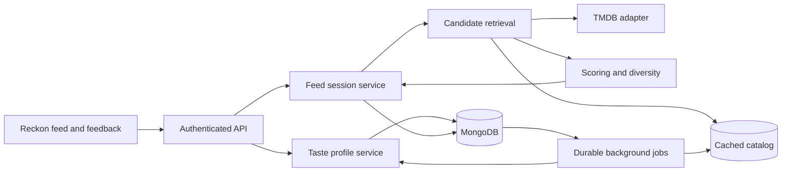

# MovieReckon refactoring plan

Prepared September 5, 2026. Status: implementation in progress; the delivery and release gates below are tracked separately.

### Implementation progress — September 5, 2026

- Preserved existing gRPC server-external setup and the hybrid routing architecture. No real gRPC service has been connected by this refactor.
- Movies, Series, Upcoming and Search use validated URL filter state. Search dispatches movie/TV/person queries upstream with pagination and retry. Series watch region is independent of original language, and provider choices are validated for the selected region. Unsupported category/filter combinations are cleared visibly.
- Upgraded the dependency groups and migrated affected calendar, chart, email and test configuration APIs. Next.js is 16.3.4, React 19.2.8 and TypeScript 6.0.3; Node types match Node 22. The [dependency inventory](dependency-inventory.md) records package-specific outcomes and compatibility holds. Removed the unused Vercel builder dependency after replacing its type-only imports with Next request/response aliases. A clean `npm ci` installed 616 packages and audited 617 with zero known vulnerabilities; peer-tree checks pass. Two optional Sharp/WASM packages are reported as extraneous by npm even after the clean install.
- Added a v2 recommendation feed with signed, user/filter-bound cursors; persisted sessions, deliveries and batches; generation leases; replay/checkpoint repair; independent retrieval stream positions; and buffered unserved candidates. Fixture tests exercise more than 1,000 unique deliveries, failures, retries and old-page replay without rewinding newer work.
- Added versioned per-user taste profiles derived from actual preferences and interactions, with canonical full-history exclusion checks. Watched or displayed titles do not automatically become strong positive signals. Dynamic taste controls and feedback completion are in progress; no predefined user taste is required.
- Connected Reckon to cursor-based infinite queries with account-scoped keys and server-side filters. The new feed is explicitly enabled with the build-time `NEXT_PUBLIC_RECOMMENDATIONS_V2=true` flag; default builds retain the legacy endpoint for rollback. Both default and v2-enabled production builds pass. Further QA covers continuation errors, expiry recovery, profile invalidation races and the remaining taste UI.
- Validation milestones: the upgraded production build passed; the filter browser harness passed 24 assertions across 1440px, 820px and 390px with mocked authentication/catalog responses, including outgoing filter parameters and returned title identities. Real poster proxy responses loaded successfully in the browser. These are not live authentication or catalog-quality tests.
- The full suite reached 186 passing tests before subsequent additions; the independent taste suite passes 11 cases. Added passing independent regressions for watchlist concurrency (3), server-authoritative authentication (2), dynamic ranking winner changes (3), Upcoming failures (3) and season-selection persistence (1). The suppression-service test boundary is repaired. The latest full run passes 220 tests, with 12 opt-in native-Mongo tests skipped by default and passing in their separate local replica-set runs. Strict Mongo update-contract QA also verifies disjoint operator paths for taste controls. Final checks will be repeated after the remaining changes settle.
- Watchlist changes are scoped to the active account and pending item mutation. Regression checks cover concurrent additions during failed reorder, stale refreshes and rapid toggles. Server-resolved anonymous authentication ignores stale browser identity; history/session cache and library-state/privacy expansion remain under review. Upcoming source errors now surface with retry, and TV season choice survives same-show refetch.
- Three opt-in native-Mongo protocol tests were added. The live attempt connected but access to the uniquely named disposable database failed with MongoDB code 8000 before any test writes. A later isolated local MongoDB 8.0.29 replica-set run passes all three native-driver tests: fresh-client replay, concurrent cursor continuation and canonical full-history exclusions. Four additional native taste-control tests pass for exploration/exclusion/restoration, reset boundaries, temporary suppression and concurrent profile invalidation. Generated test databases were dropped afterward. The configured cluster still needs its own staging permission and rollout checks; existing user data was not changed by QA.
- The Pick Tonight feedback Undo now uses an explicit idempotent removal endpoint instead of relying on toggle timing. Recommendation v2 schema indexes moved from the feed request path into shared Mongo schema bootstrap. Still open: complete the durable job and versioned migration runners, catalog caching, stage metrics, accessibility and bounded feed rendering; then repeat final browser/build/clean-install regression and complete human relevance and production performance gates. The later conditional follow-ups remain as specified below.

Native privacy QA passes all five checks after repairing feedback-summary reconciliation and terminal-deletion cleanup. Automated server-driven reconciliation is still part of the pending operations slice. Live TMDB verification awaits a configured server-side key; the user is supplying it locally.

Implementation evidence does not establish the proposed human-rated relevance uplift. Production rollout, real authentication smoke tests, isolated backup restoration and deployment-specific performance measurements require their own recorded evidence.

Use the [recommendation release checklist](recommendation-release-checklist.md) for reproducible commands, database-test safeguards and outstanding rollout evidence. Latest full local checkpoint: production builds, lint and TypeScript have passed; 220 tests pass, while the 12 native-Mongo tests are opt-in and skipped in the default run (all 12 pass separately). Further edits require a final check.

## Product direction

Make Reckon the central personalized discovery experience for movies and series. A user selects initial preferences, reacts to titles, and receives increasingly relevant suggestions as their taste develops. Browsing should continue beyond the current fixed recommendation batch.

**Priority update:** the user reports that current recommendations are inaccurate. Improving relevance is a release requirement alongside continuous loading. Build a Spotify-inspired taste and discovery experience for film and TV; this describes the desired experience, not a claim to reproduce Spotify's proprietary algorithm or a requirement to integrate Spotify.

“Unlimited” means no arbitrary lifetime recommendation cap: continuously retrieve fresh eligible titles while the available catalog supports them. It cannot mean infinitely many unique titles or unlimited upstream API calls. When strict filters exhaust eligible content, explain that and offer broader discovery; do not silently ignore preferences or recycle excluded titles.

## What exists today

The knowledge graph was consulted first, followed by source inspection. Its recorded commit matches HEAD, but its index is older than this review; implementation details below were checked in current files.

| Area | Current implementation | Refactoring implication |
| --- | --- | --- |
| Application | Next.js 16 and React 19, Next catch-all page plus React Router in `src/frontend/app/App.tsx` | Consolidate routing incrementally after improving Reckon. |
| Backend | Next API wrappers delegating to `src/backend/api/_handlers`, MongoDB, auth compatibility paths | A backend already exists; preserve user accounts and data. |
| Ranking | Shared candidate normalization, scoring and diversity modules under `src/shared/lib/recommendation` | Retain and test the useful ranking core. |
| Taste inputs | Preferences, watched titles, likes, watchlist, feedback; similarity based on genres, keywords, people, era and runtime | Materialize a versioned taste profile instead of reconstructing all signals on each feed build. |
| Collaborative signals | Bounded MongoDB aggregation in `recommendation-collaborative.ts`, with minimum evidence thresholds | Keep optional, particularly while the user base is small. |
| Reckon UI | Approximately 1,200 lines combining setup, preferences, filtering, rendering and expansion | Extract focused UI components and a single feed hook. |
| Feed handler | Approximately 1,450 lines of database reads, source discovery, enrichment, ranking, caching and response construction | Separate transport, orchestration, persistence and pure ranking. |
| Alternate AI endpoint | Separate OpenAI-based pipeline exists; the inspected Reckon hook uses the standard endpoint | Audit consumers and consolidate product behavior before retiring or retaining an experimental provider. |

The earlier May design already favors TMDB-backed, explainable ranking and optional collaborative signals. This plan extends that foundation with persistent learning and genuine pagination. It does not require a paid LLM for normal recommendations.

### Specific bottlenecks verified in code

- `recommendations.ts` caps candidates at 900 and outputs at 150, 180 or 220 titles. Many discovery sources request page 1 or pages 1–2.
- Both client request construction and server parsing cap supplied exclusions at 160 IDs. Client deduplication prevents some visible repeats, but discarded duplicates can consume later responses and produce premature exhaustion.
- `Reckon.tsx` initially renders 48 items and reveals 32 more at a time from memory. Additional discovery is a separate “more like this” operation rather than a continuous server cursor.
- More-like-this requests seed from displayed recommendations. Displaying a title is not evidence that a user likes it; automatic expansion should use actual taste signals. Keep “more like this” as an explicit title action.
- The feed hook rotates and refetches recommendations; the page resets extra items when its recommendations change. Stabilize scrolling sessions rather than periodically replacing their source list.
- The feed hook's query key lacks an explicit user ID. Add account identity to every personalized cache key and verify logout/account-switch cleanup.
- The handler reads bounded recent history/likes/watchlist/feedback. Those bounds are reasonable for taste computation, but full-history exclusions must be queried separately so older watched or rejected titles cannot slip back in.
- Feed caching uses a process-local Map. Shared persistent feed sessions are needed for consistent continuation across server instances.

Five targeted recommendation suites passed: **36 tests** covering ranking, dynamic ordering, endpoint behavior, collaborative boosts and metadata enrichment. This is a unit-test baseline, not proof of production latency or recommendation quality. Live database connectivity, live browser behavior and deployment capacity were not assessed in this planning pass.

## Backend decision

Keep **Next.js + TypeScript + MongoDB** as one modular application. There is no demonstrated need to migrate users to another database or introduce a separate Python service. Add durable catalog, profile, feed and job storage to the existing backend.

Use MongoDB for shared feed state initially. Add Redis only if measured latency or contention justifies another service. Run metadata refresh and profile rebuild work through a durable job mechanism with retries, leases and idempotency. Start with a MongoDB jobs collection and a scheduled authenticated worker entrypoint; move processing to a dedicated worker if measured work exceeds deployment execution limits. Do not rely on unawaited work after an HTTP response.

Treat index changes as versioned deployment migrations instead of expanding request-time index bootstrap indefinitely. Preserve authentication compatibility until deployed session, email and OAuth regression checks pass.

## Taste and feedback model

- Onboarding: choose languages, genres, movie/series preference, and optionally a few liked or disliked titles. Allow skipping; label initial discovery honestly.
- Keep explicit preferences separate from inferred affinities. Distinguish hard filters from soft preferences; hard filters are never relaxed automatically.
- Learn genre, keyword, cast/creator, language and era affinities from actual feedback. Likes and explicit positive ratings are strong evidence; saving is weaker intent; merely marking watched is neutral or weak evidence, not an automatic endorsement.
- Separate “not interested” from “not now.” The former excludes the title and supplies restrained negative evidence; the latter temporarily suppresses it. A single rejection should not eliminate an entire genre.
- Record impressions for exposure accounting, not as positive preference signals. Only log an impression after a card has actually been visible.
- Decay inferred preferences over time while retaining explicit choices. Version the profile after relevant mutations, including undo, watchlist changes and history deletion.
- Support editing preferences, undoing feedback and resetting learned taste. A reset must also prevent retained events from rebuilding the old profile unintentionally.
- Preserve existing exclusions for watched, liked, watchlisted and explicitly rejected content in the default discovery feed. Use full-history membership checks against each candidate batch.

Ranking remains a hybrid of content similarity, explicit preference match, restrained popularity/quality signals, novelty and diversity. Start with configurable exploration around 10–20%, subject to available eligible titles, and tune with evaluation. Keep collaborative boosts evidence-gated. Explanations must derive from real contributing signals, such as a liked title or preferred genre.

## Accuracy improvements: make taste drive the results

Treat the user's accuracy report as a product problem to reproduce. The existing tests establish behavior, not whether people enjoy the suggestions. The following are investigation targets and design improvements, not all confirmed causes of the current inaccuracy.

1. **Establish a relevance baseline first.** Create representative taste cases: regional-language cinema, mixed-language viewers, crime series, animation, romance, niche science fiction, users with conflicting likes/dislikes, and users with no history. For each, keep human-rated relevant/irrelevant examples and compare the old and new top 20 results. Include obscure titles so popularity cannot masquerade as personalization.
2. **Correct the signal meaning.** Audit where watching, saving, skipping and liking currently affect retrieval and scoring. Do not train on recommendations simply because the system displayed them. Avoid counting one title's watch, save and like as three independent strong endorsements. Use explicit reactions as the most reliable evidence and confidence-weight weak signals.
3. **Retrieve for multiple interests.** A person may enjoy both gentle comedies and dark crime dramas. Maintain several taste clusters rather than averaging them into one generic profile. Retrieve candidates per cluster, then allocate feed slots by user interest and available evidence. Keep movie and series signals distinguishable while allowing shared interests to transfer.
4. **Improve catalog features.** Normalize movie/TV genre differences, localized keywords, creators and cast. Track missing metadata and feature confidence; missing runtime or keywords must not behave like a dislike. Distinguish feature-film length from episode length. Mood, tone and pacing labels need a curated or validated source and a confidence value; do not invent them from genre alone.
5. **Make preferences stronger than popularity.** Apply hard eligibility constraints before ranking. Rank eligible titles primarily by explicit taste and supported similarity, with restrained quality/popularity tie-breakers. Normalize source scores so a large trending pool cannot overwhelm a small but relevant niche source. Tune weights against the baseline instead of selecting them only by intuition.
6. **Use negative feedback precisely.** “Too scary,” “wrong language,” “not this franchise,” and “already watched” mean different things. Let users optionally specify the reason; update only the relevant signal. A mixed-genre title rejection must not suppress all its genres equally.
7. **Adapt without becoming repetitive.** Maintain long-term interests and a separate short-term context. Reserve exploration slots, but retrieve those from adjacent interests and respect exclusions. Add recent-exposure suppression across visits so refreshing does not continually show the same unseen titles; distinguish this temporary suppression from permanent user exclusions.
8. **Make advanced models earn their place.** Start with the explainable engine and improved candidate retrieval. Evaluate optional semantic embeddings or learned ranking only if they improve held-out relevance, diversity and cost/latency together. Keep collaborative ranking optional until there is sufficient first-party feedback; paid AI is not a prerequisite.

## Spotify-inspired Reckon Taste experience

### Your Taste onboarding and controls

- Present searchable movie and series cards and invite users to pick 5–10 favorites and optionally a few dislikes. This is an invitation, not a minimum required to enter Reckon.
- Ask for preferred languages, genres and movie/series balance. Offer optional era, runtime, region and streaming-provider preferences where metadata is available. Clearly separate “prefer” from “only show.”
- Provide a **Your Taste** screen with editable interests and concrete examples: “You often like investigative thrillers” with the titles that contributed. Show whether each interest was chosen or learned, and expose correction/removal controls.
- Support multiple interests, such as “Slow-burn crime,” “Comfort comedies” and “Indian independent films,” when evidence supports the label. Do not force every viewer into one taste category.
- Offer a **Familiar ↔ Adventurous** control that adjusts exploration within hard filters. Start new profiles with cautious, transparent defaults.
- Let users exclude individual activity from taste learning, useful when choosing something for someone else. Excluding a title from taste learning does not erase its watched status or make it eligible for rediscovery automatically.

### Personalized mixes and discovery

| Surface | Intended behavior |
| --- | --- |
| **Made for You** | The main continuously loading feed, combining the user's established interests with measured exploration. |
| **Your Taste Mixes** | Several focused collections reflecting different interests; each opens its own paginated feed instead of repeating the same top titles under different headings. |
| **Discover This Week** | A stable weekly collection of unfamiliar eligible titles near the user's tastes. Do not reshuffle it on every visit. |
| **New for Your Taste** | Newly released movies and series ranked by relevance, with region-aware release/availability data where supported. |
| **Because You Liked…** | Recommendations connected to a real liked title, with specific shared attributes and an explicit “more like this” action. |
| **Tonight's Mood** | Temporary context such as lighthearted, tense, thought-provoking or family viewing, plus time available. Context expires with the session unless the user chooses to save it as a preference. |

Launch **Your Taste**, **Made for You** and **Because You Liked…** first. Add multiple mixes and weekly discovery once relevance gates pass; add mood filtering after its metadata has been validated. Keep provider availability region-aware and label unknown availability rather than presenting it as verified. Implement family/certification constraints only with reliable region-specific metadata; unknown certification cannot satisfy a strict family filter.

Each card offers clear feedback: **Love it**, **More like this**, **Not for me**, **Not now**, **Already watched**, and **Save**. Distinguish liking a watched title from wanting similar suggestions before watching it. Every feedback action offers undo. Ask an occasional optional “Which would you rather watch?” question when it would resolve uncertain taste; never interrupt ordinary browsing with mandatory questions.

Explanations should name the actual matching signals, such as “Because you liked these two mysteries and prefer Korean series.” Avoid invented match percentages such as “98% your taste” unless a probability has been calibrated against real outcomes. When there is little evidence, say “Based on your selected preferences” or label a pick as exploration.

### Learning and session behavior

- Feedback immediately hides or updates the affected card. A proposed initial target is for persisted feedback to influence the next newly generated batch within 5 seconds under normal operation; validate this with integration tests and telemetry.
- Increment the taste version when durable preferences or relevant feedback change. Keep the active session's displayed order stable; bind each newly generated batch to its effective taste version for debugging and reproducibility.
- A mood change, taste mix change or strict filter change starts a new feed session. Include that context in cache and cursor identity so results cannot leak between modes.
- Stable weekly mixes are stored as versioned snapshots. Recheck current hard exclusions and filters on read; replace removed titles deterministically rather than showing newly rejected content for the sake of stability.
- Cross-session exposure suppression uses user/title records with a bounded cooldown. It may relax only when explicitly identified as temporary exposure suppression; watched/disliked and strict-filter rules remain intact.
- Persist only interactions the app actually observes. Do not infer full-film completion or off-platform streaming behavior from a detail click or trailer play.

## Continuous feed contract

Introduce a versioned endpoint, initially alongside the existing one:

`GET /api/user/recommendations/v2?cursor=...&limit=24&...filters`

Return `items`, per-item explanations, `nextCursor`, `hasMore`, `profileVersion`, `feedSessionId`, and an explicit state such as `ready`, `retryable` or `exhausted`.

1. The first request creates a user-owned session tied to filter/sort settings, profile version and ranking version.
2. Store ranked batches and per-source continuation state. Advance TMDB discovery sources to new pages and rotate eligible seeds; reaching an empty source is not the end of the entire feed.
3. Use opaque, validated cursors tied to that session and batch position. Validate ownership and expiry in application code. Reject changed filters with an old cursor.
4. A retried cursor returns the same stored page. Coordinate concurrent generation with a lease or atomic version check so parallel requests cannot create conflicting continuations.
5. Store delivered membership separately with a unique `(sessionId, contentKey)` index. Do not grow an unbounded array inside a MongoDB document or a URL exclusion list.
6. Recheck user-owned exclusions before serving pages. New negative feedback immediately hides the affected title; newly learned ranking applies to subsequent batches without shuffling already viewed cards.
7. Bound each request's work and upstream concurrency. If candidates remain but replenishment needs more time, return a retryable state rather than claiming exhaustion. Refill with durable jobs when appropriate.
8. Treat sort changes as new sessions. Relevance is personalized ordering; rating/date sorting must be implemented on the backend over a clearly defined eligible result set, rather than sorting just downloaded cards.
9. Keep cursors and feed batches for a bounded session retention period. Expired sessions offer a recoverable refresh. MongoDB TTL is cleanup, not an authorization or expiry guarantee.

Use TanStack `useInfiniteQuery`, including user identity and filters in the key, for the client. Fetch the next page near the end, preserve position when returning from details, cancel obsolete requests and show retry controls. Add grid virtualization and bounded page retention with backward-page restoration so long browsing sessions do not grow browser memory indefinitely.

## Data additions

| Collection | Purpose and important keys |
| --- | --- |
| `catalog_titles` | Normalized movie/TV metadata; unique `(type, tmdbId)`; freshness and available feature flags. |
| `user_taste_profiles` | One versioned, rebuildable profile per user; weights, confidence, explicit/inferred separation and processing watermark. |
| `user_taste_profiles` extensions | Multiple interest clusters, separate movie/TV affinities, exploration preference, excluded learning activity, and evidence for editable taste explanations. |
| `user_interaction_events` | Idempotent feedback events with user, title, action, timestamp and event ID; bounded retention policy. |
| `user_title_exposures` | User/title last-visible timestamp and cooldown for cross-session repetition control; unique user/title key and bounded retention. |
| `recommendation_mix_snapshots` | User-owned weekly or taste mix contents, mix/context identity, time period, model/profile version and refresh policy. |
| `recommendation_sessions` | User, filters hash, ranking/profile versions, source continuation, expiry and generation lease. |
| `recommendation_batches` | Stable page contents, explanations and cursor position; unique session/page key and expiry. |
| `recommendation_deliveries` | Session/title membership for deduplication; unique compound key and expiry. |
| `recommendation_jobs` | Idempotency key, job type, retry count, availability time, lease and terminal failure state. |

Keep existing user collections authoritative during migration. Persist each interaction and its profile-rebuild intent atomically where supported, or use a documented reconciliation process to recover missed jobs. Backfill profiles from existing data idempotently; never manufacture likes from every watched title. Account deletion and taste reset must cover all new user-derived collections.

## Implementation sequence

### Project-wide filter reliability

The user reports intermittent incorrect filtering across the app. Audit every visible category, filter, sort control, search tab and reset action. The inventory must include Movies, Series, Upcoming, Search, Reckon, and any controls present in Home, profile/history/likes, watchlist, person/detail pages and theater administration. Confirm each surface's actual controls before changing it; do not add irrelevant filters merely for consistency.

Initial source inspection found separate category/discover branches in Movies and Series, provider-region selection coupled to category/language in Series, and Search type tabs filtering returned results locally. These are investigation targets, not a completed diagnosis of every reported failure.

| Surface | Required checks and improvements |
| --- | --- |
| Movies | Genre, year, language/category and sort combinations; preserve category meaning when switching to discovery endpoints; verify ordering across pages. |
| Series | TV-specific genre IDs, first-air dates and sort values; ensure category shortcuts honor selected controls; decouple watch region from original language. |
| Upcoming | Movie release versus TV first-air dates, inclusive range boundaries, timezone handling, region and provider combinations, and duplicate-free merged pagination. |
| Search | Query plus movie/TV/person tabs, appropriate source pagination and counts; do not claim no matching titles after filtering only one mixed-results page. |
| Reckon | Apply strict filters before ranking and pagination, keep soft taste preferences distinct, and bind sessions to every relevant filter/sort/context value. |
| Account lists and other surfaces | Check all existing filter/sort controls, complete-list versus loaded-page semantics, reset, empty states, and list updates after user actions. |

Implement a shared typed filter contract with per-surface capabilities, validated URL parsing/serialization, and separate movie/TV API mappings. Share semantics and control components without forcing every route to use an identical query or backend endpoint.

- Treat URL state as the canonical state for navigable filters. Direct links, refresh, browser back/forward and restoring a route must reproduce the same selected controls and results without effect loops.
- Include all result-affecting inputs in query keys: category, genre, date/year, language, region, provider, sort/direction and relevant account/context identity. Cancel obsolete requests and prevent late responses from replacing newer selections.
- Reset pagination, cursor and derived results atomically when filters change. Never append pages fetched with old settings. During loading, do not present the old result set as if it matches the new controls.
- Document category/filter precedence. If a category implies a constraint that conflicts with a selection, visibly clear or disable the conflicting selection with an explanation. Never silently ignore an enabled control.
- Apply global filtering and sorting server-side or through the appropriate upstream endpoint. For merged sources, define a stable merge and tie-breaker. If a source cannot support a global sort, remove or clearly scope that option rather than sorting only the current page under a global label.
- Use the user's chosen watch region for provider availability; language does not determine viewing country. Validate provider IDs by region and supported monetization type. Handle unknown availability explicitly.
- Use explicit AND/OR rules for multiple selections. Validate malformed query parameters, unavailable options and date ranges; normalize defaults consistently. Preserve hard constraints when data is sparse.
- Avoid early empty states: continue bounded retrieval when source pages contain no eligible items but further pages remain. Distinguish genuine exhaustion from errors and show a retry action for failures.
- Standardize active-filter chips, individual removal, Clear all and result/loading feedback. Counts must represent the known dataset, not imply an unknown global total. Mobile filter sheets should use a deliberate draft-and-Apply flow, with Cancel discarding drafts; desktop and mobile must apply identical semantics.

Acceptance: add adapter/unit tests for parameter mapping and combination rules, API tests for correct filtering before pagination, and browser tests for individual controls, pairwise combinations and high-risk combinations of three or more controls. Cover rapid changes, clear/reset, back/forward, direct URLs, empty/error states, switching tabs/categories, loading additional pages and desktop/tablet/mobile interaction. Each reproduced bug gets a focused regression test. Track selected controls through outgoing parameters to returned titles so validation goes beyond visual state.

### Next.js and all library upgrades

Upgrade **all direct dependencies and dev dependencies** to current stable releases, including required major-version migrations. Refresh compatible transitive dependencies in the lockfile. If a current release is incompatible, resolve its migration or document the exact blocker and follow-up; do not silently treat a skipped package as upgraded. Do not adopt canary/beta builds by default.

The manifest inspected for this plan declares `next: ^16.1.7`, `react/react-dom: ^19.2.4`, TypeScript `^5.9.3`, TanStack Query `^5.90.21`, Tailwind `^4.2.0`, and MongoDB `^7.1.0`. These are declared ranges, not verified installed versions or recommended final targets. Resolve and record exact current/target versions from the registry at implementation time so this plan does not freeze a stale release number.

1. Record the existing manifest/lockfile/config changes and establish the full test/build baseline. Capture Node/npm versions, deployment runtime and `npm ls` output. Run a registry-backed outdated inventory and create a package-by-package table of installed, wanted and latest stable versions, peer requirements, engine requirements and migration notes.
2. Upgrade Next.js, React, React DOM and associated types as one compatible group. Read the installed Next.js guides and the target release's official upgrade notes; inspect codemod changes. Validate server rendering, hydration, route handling, API wrappers, cookies/auth and caching against this project's hybrid routing.
3. Keep the existing explicit Webpack scripts initially. Assess any bundler switch as a separate change with its own build and runtime verification; do not combine it accidentally with the version bump.
4. Upgrade TypeScript, ESLint/plugins, Node types and test tooling in compatible groups. Align Node types with the deployed runtime. Retain Vite-related packages needed by Vitest until their consumers are verified; a Next.js app can still need them for tests.
5. Upgrade UI/data packages in groups: TanStack Query and routing; Tailwind/PostCSS and styling; Radix/forms/Zod/date controls; animation/carousels/charts and remaining components. Check copied UI component source for compatibility changes, not only package versions.
6. Upgrade backend groups: Better Auth with its Mongo adapter, MongoDB driver, token/email libraries, Vercel integrations and remaining service clients. Test login, logout, refresh, OAuth, email, database operations and uploads using the new versions. Do not combine this with retiring auth compatibility paths.
7. Review every remaining package, deprecation and override, including `esbuild` and `postcss` overrides. Remove overrides only when the resolved tree proves they are unnecessary. Remove unused dependencies only after checking runtime, tests, scripts and build configuration for consumers. Do not use forced peer-dependency resolution to conceal incompatible packages.
8. Update `package.json` and `package-lock.json` together and verify a clean `npm ci`. Run lint, typecheck, tests, production build, production-server smoke tests and `npm ls` peer checks. Inspect dependency advisories and address upgrade-related issues; avoid indiscriminate forced audit fixes.

Acceptance: the package inventory accounts for every direct and dev dependency as upgraded, already current, removed with evidence, or explicitly blocked. Clean installation is reproducible, peer/engine constraints are satisfied, and the complete filter, auth, recommendation and responsive-image regression suite passes. Record resolved versions and retain a reversible manifest/lockfile change per upgrade group.

Execute the baseline, dependency upgrades and filter repairs as separate reviewable changes early in the project. Establish the supported dependency baseline before major feature refactoring, and fix reproduced filter bugs before rolling out new Reckon Taste surfaces. Re-run filter regressions after upgrades; passing on the old library versions is insufficient.

| Phase | Work | Completion gate |
| --- | --- | --- |
| 1. Baseline and boundaries | Record existing changes, run full checks, build human-rated taste cases, audit signal semantics and establish relevance, latency and TMDB-request baselines; extract contracts, adapters and ranking orchestration. | Existing behavior characterized; accuracy weaknesses reproducible; responsibilities separated. |
| 2. Persistent learning and accuracy | Add migrations, multi-interest profiles, confidence-aware features, interaction contract and durable rebuild jobs; backfill users, improve candidate retrieval, tune ranking and account-scope caches. | Feedback, undo and reset update profiles without double-counting; representative top-20 relevance improves before UI rollout. |
| 3. Feed backend | Implement catalog cache, resumable source retrieval, sessions, stable cursors, full-history exclusions, bounded generation and failure recovery. | More than 1,000 unique results across fixture-backed pages, no arbitrary 220-title stop, correct retries and cross-instance continuation. |
| 4. Reckon Taste experience | Build Your Taste onboarding/editor, Made for You, Because You Liked, exploration controls and explainable feedback; adopt infinite queries, stable scroll and virtualization. | Taste edits and feedback affect new picks; new and returning users can browse continuously on desktop/tablet/mobile. |
| 5. Quality evaluation, mixes and rollout | Shadow and compare ranking, tune diversity, add monitoring and release to a small cohort; progressively add taste mixes, stable weekly discovery and validated mood context. | Relevance and latency gates pass per cohort; mixes remain distinct, mood stays temporary, and rollback preserves interactions. |
| 6. Project-wide cleanup | Move feature routes incrementally to Next App Router, consolidate API/client contracts and auth pathways, audit unused dependencies and alternate AI code. | All routes and auth flows pass regression checks; remove compatibility code only after its consumers migrate. |

Phases 1–4, project-wide filter repairs and dependency upgrades are the core product delivery. Route consolidation is intentionally later so it cannot block continuous personalized recommendations. Use small reviewable changes per phase; avoid combining database migration, auth migration and route migration into one release.

## Additional product gaps and priorities

This gap review distinguishes requirements missing or under-specified in the plan from verified missing implementation. Existing watchlist, history, profile and detail features should be improved rather than recreated. Audit their current behavior before implementing the extensions below.

### Include in the core release

| Improvement | Why it matters | Acceptance |
| --- | --- | --- |
| **Help users choose, not only scroll** | Continuous discovery can still leave someone undecided. Add an optional “Pick for tonight” shortlist of three eligible, explained suggestions using available time and current context. | Users can compare, save or reject the shortlist; no silent relaxation of constraints and no repeated rejects. Measure optional “I found something” feedback and time to a stated choice, not just cards viewed. |
| **One coherent personal library** | Saved, watching, completed, dropped and liked express different things. Define movie/series status transitions and keep rating separate from status; permit marking a movie watched without automatically liking it. | A change is reflected consistently in cards, details, library and Reckon. Mutations survive refresh and cross-device use; failed optimistic updates roll back visibly and retries are idempotent. Define deliberate rediscovery separately from default recommendation exclusions. |
| **Search that finds the intended title** | Filter correctness alone does not address original/localized titles, remakes, punctuation or weak matches. Show year and media type, search aliases where supported, and offer understandable no-result recovery. | Test localized titles, duplicate names, movies versus series, people and common spelling variations; label approximate matches and never invent title records. |
| **Useful title details without spoilers** | Users need to know whether a suggestion fits tonight. Prioritize runtime or episode commitment, region-specific watch options, release status and reasons for the recommendation. Keep episode descriptions and revealing content behind deliberate interaction where possible. | Movie and episode lengths are clearly distinguished; missing availability is honest; watch links point to supported destinations and relevant region. |
| **Accessibility and motion controls** | Responsive layout alone does not ensure that filters, carousels and infinite feeds are usable. Cover keyboard navigation, focus restoration, labels, contrast, reduced motion and user-controlled sound. | Keyboard-only users complete setup, filters, feedback and detail navigation; auto-moving carousels can be paused. Keep an accessible Load more alternative and access to the footer; virtualized cards must not remove the currently focused element. |
| **User control over personal data** | A taste profile needs understandable controls beyond a reset button. Offer export, account deletion and an explanation of which activities influence recommendations. | Export includes relevant library/preferences; deletion covers derived profiles, sessions, jobs and caches; delayed jobs cannot recreate deleted data. Define retention and recovery handling explicitly without claiming legal compliance from these controls alone. |
| **Operations and recovery** | A successful build does not prove that the deployed recommendation system stays healthy. Add dependency-health signals, structured redacted errors and recommendation-stage metrics. | Diagnose low candidate supply, upstream failures, profile lag and ranking failures separately. Test backup restoration in an isolated environment and rehearse rollout rollback before data migrations. Determine recovery targets from the deployment budget. |

Accessibility details should follow [W3C carousel guidance](https://www.w3.org/WAI/tutorials/carousels/), including keyboard operation and pausing movement. Backup verification should include a test restore, as described in [MongoDB backup guidance](https://www.mongodb.com/docs/manual/tutorial/backup-and-restore-tools/); confirm available backup features for the actual deployment tier.

### Follow after relevance and reliability are proven

- **Try before signup:** evaluate a limited guest taste preview with local preferences, followed by an explicit, idempotent merge into an authenticated profile. Preserve existing account information and keep guest/account caches isolated. Do not expose authenticated APIs to make this work.
- **Series progress:** extend the library to season/episode progress, completed versus ongoing/cancelled series and an explicit next episode. Start with manual tracking; external streaming completion is not observable by default.
- **Group choice:** let consenting users combine selected tastes for a shared shortlist without permanently altering their individual profiles. Keep participants' private feedback private.
- **Opt-in release reminders:** useful for saved titles and followed series only after availability/date freshness and durable job deduplication are reliable. Provide quiet hours and unsubscribe; do not make outbound notifications part of the initial release.
- **Search visibility and sharing:** improve metadata, canonical URLs and share previews for public title pages; keep personal feeds, tastes and libraries private by default. Add public list sharing only as a deliberate user action.

### Delivery assignments for these improvements

These improvements are included in the plan with the following delivery assignments:

| Delivery stage | Included work | Required evidence |
| --- | --- | --- |
| Phase 1: baseline | Audit personal-library transitions, search failures, accessibility barriers and deployment recovery capabilities alongside recommendation accuracy. | Reproducible cases and baseline results; clearly distinguish existing working behavior from defects and new features. |
| Phase 2: data and learning | Define separate library status and rating contracts, reliable cross-device mutations, export/deletion handling and protection against delayed jobs restoring deleted user data. | Integration tests for transitions, undo, retry, account isolation, export and deletion. |
| Phases 3–4: discovery and UI | Deliver Pick for tonight, better search matching, spoiler-aware details and consistent library actions; apply keyboard, focus, reduced-motion and sound controls throughout the affected flows. | End-to-end checks from discovery through selection/save, including mobile, keyboard use, failures and refresh. |
| Phase 5: release gate | Enable stage-level monitoring, verify isolated backup restoration and rehearse rollback; assess whether users find a suitable title. | Recorded restore/rollback results and quality/performance checks before wider rollout. |
| Follow-up A | Guest taste preview and explicit account merge; manual season/episode tracking. | Guest/account isolation and merge tests; progress persists without being mistaken for positive taste feedback. |
| Follow-up B | Consent-based group choice and opt-in release reminders. | Private preferences remain private; reminder jobs deduplicate and respect unsubscribe and quiet hours. |
| Phase 6 and sharing follow-up | Public-title metadata, canonical links and share previews; optional user-controlled public lists. | Public previews work while private profiles, feeds and lists remain inaccessible to other users. |

The core priorities remain accuracy, filters, supported dependencies and stable continuous browsing. All additional core requirements above are part of the first improved release. Guest mode, episode tracking, group choice and notifications remain planned follow-up work so they do not delay that release.

## Acceptance and evaluation

- Fixtures spanning thousands of movie and TV IDs demonstrate stable pagination, no duplicate deliveries, correct exclusion beyond 160 IDs and beyond recent-history read limits, and movie/TV ID collision safety.
- Cursor tests cover tampering, another user's session, expiry, filter mismatch, retry, concurrent requests and process restart.
- Taste tests cover cold start, language/genre constraints, positive and negative feedback, watch-versus-like distinction, undo, reset and preference drift.
- Taste-experience tests cover distinct interest clusters, excluding activity from learning, exploration settings, temporary mood isolation, stable weekly mixes and cross-session exposure cooldowns. Cross-user and cross-mode cache isolation are required.
- Measure candidate recall separately from ranking quality: a ranker cannot recover relevant titles absent from its candidate pool. Track human-judged Precision@20 and NDCG@20 (whether relevant titles appear near the top), plus per-interest and per-language coverage. Treat unobserved items as unknown rather than automatically disliked.
- Proposed accuracy release gate: at least 10% relative improvement in human-rated NDCG@20 against the existing engine on the fixed evaluation set, zero hard-constraint violations in test fixtures, and no material regression for niche-language or cold-start cohorts. Freeze the evaluation set and cohort thresholds before tuning; use a separate held-out set and report uncertainty. This is a target, not a claimed improvement.
- For the initial small user base, combine optional satisfaction feedback and blinded comparisons with offline evaluation. Run an online experiment only once traffic supports meaningful conclusions; avoid shipping solely because a noisy click metric rose.
- Failure tests cover TMDB 429/timeouts, partial sources, MongoDB failures and job retries. Temporary failure must not become permanent exhaustion. Cached results must still respect current exclusions.
- UI checks cover 1440px, 820px and 390px, accessible loading controls, bounded DOM growth, scroll restoration, account switches and actual poster loading/fallbacks.
- Track saves/positive reactions per impression, rejection rate, coverage, repetition and diversity. Use temporal holdout evaluation for ranking changes; avoid training/evaluation leakage. Click-through alone is insufficient.
- Proposed initial performance targets, to validate against deployment measurements: cached next-page API p95 under 500ms and first useful page under 2 seconds. Cap upstream calls per replenishment batch and measure calls per 100 cards served.
- Before release run lint, typecheck, tests, production build and diff checks, plus browser and staging database validation. Keep the previous feed available through the rollout flag until those gates pass.

## Supporting references

- [Next.js upgrading guide](https://nextjs.org/docs/app/guides/upgrading): use target-version migration guidance for framework updates.
- [npm outdated](https://docs.npmjs.com/cli/v11/commands/npm-outdated/): distinguish installed, range-compatible wanted and registry latest versions during the dependency inventory.
- [TanStack infinite queries](https://tanstack.com/query/latest/docs/framework/react/guides/infinite-queries): cursor-driven loading and bounded page retention.
- [TMDB rate limiting](https://developer.themoviedb.org/docs/rate-limiting): upstream limits remain relevant; respect 429 responses and bound discovery work.
- [MongoDB TTL indexes](https://www.mongodb.com/docs/manual/core/index-ttl/): expiration cleanup is asynchronous, so enforce session expiry explicitly.
- Installed Next.js migration guide reviewed at `node_modules/next/dist/docs/01-app/02-guides/migrating/app-router-migration.md`; use the installed version's relevant guides during implementation.

Implementation updates the source and dependency files described above while preserving the pre-existing gRPC setup. This document remains the delivery checklist; incomplete and externally gated items must not be marked complete from unit tests alone.
